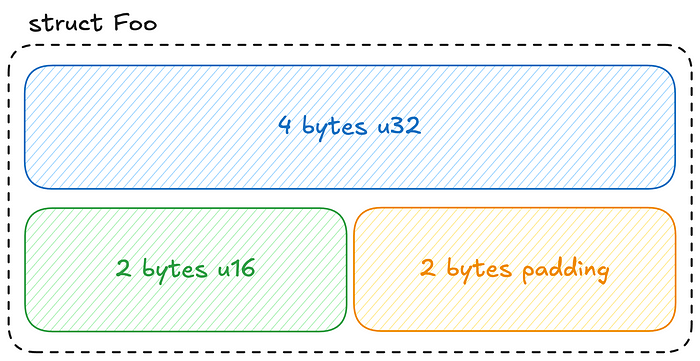
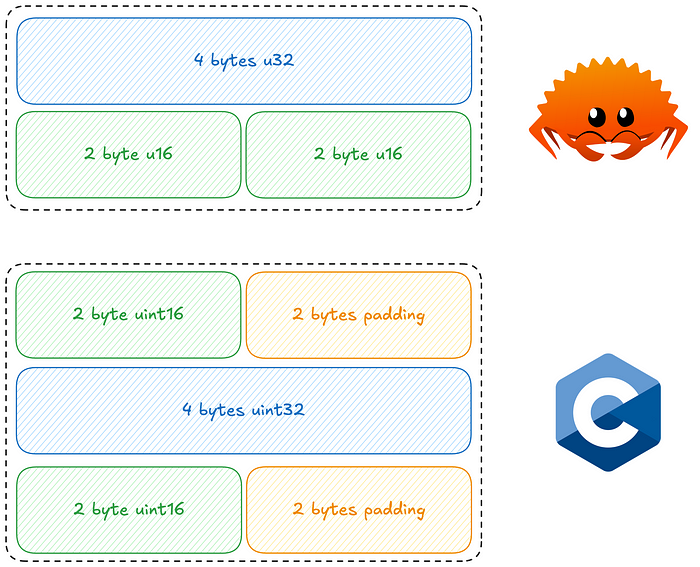
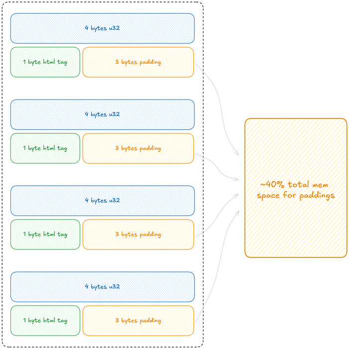
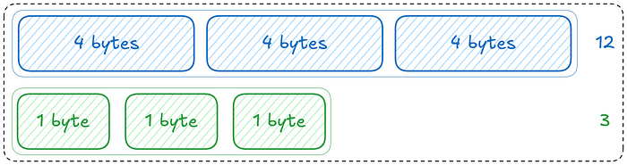

# Magic Memory Optimization in Rust and C 🥵

You won't believe how much memory we waste due to a lack of knowledge in data layout! Discover basic optimization techniques…

[Magic Memory Optimization in Rust and C 🥵 | by Random-long-int - Freedium](https://freedium.cfd/https://medium.com/@pierrelouislet/magic-memory-optimization-in-rust-and-c-b08087a92984)

If you like to optimize everything in life (like a psychopath… or like me… 😳), you'll enjoy this short article! It's crazy how much memory we waste simply due to our lack of knowledge about memory layouts. I recently watched a video by Andrew Kelley, the creator of the Zig language, and was shocked by how some basic Data-Oriented Design (DoD) tricks can significantly reduce your program's memory footprint.

Let's review the memory size in bytes of some primitive types in a programming language (Rust in this case):

- bool : 1
- u8 : 1
- u16 : 2
- u32 : 4
- u64 : 8
- char : 4

Now that you are a Rust expert and know the byte size of each primitive types, let me ask you a question. What is the size in bytes of the following struct ?

```rust
struct Foo {
    elem:  u32,
    other: u16,
}
```

You've got it… if it were 6, I wouldn't have asked you the question. While 6 isn't entirely incorrect — since the struct contains 4 bytes for a u32 and 2 bytes for a u16 — the size of a struct is calculated by aligning to the largest field and rounding the total size up to the nearest multiple of that alignment. If this isn't entirely clear, let's look at a simple representation.



_Visual representation of the **struct Foo** data layout_

Now let's gess the memory size in bytes of the following struct:

```rust
struct Bar {
    num:     u16,
    bigger:  u32,
    another: u16,
}
```

This is a bit trickier than it seems! If we follow the mental model described earlier, the Bar struct's size would be 12. If we consider the largest alignment of the struct's fields, which is 4, and round up the sizes of all other fields to 4, we get: **4 + 4 + 4 = 12**. A smarter approach would be to optimize the 'free' space filled by the padding between num and another. This would result in the following: **(2 + 2) + 4 = 8**. It seems like we've optimized the free space by rearranging the struct's fields, right? In fact, the Rust compiler is smart enough to do this automatically, but that's not the case in all strongly typed languages! Let's print the memory size of the Rust struct and then do the same for the equivalent struct in C:

The size of Rust structs in memory:
```rust
std::mem::size_of::<Bar>() // output: 8
```

The size of C structs in memory:

```rust
struct Bar {
    uint16_t num;
    uint32_t bigger;
    uint16_t another;
};

sizeof(struct Bar) // output: 12
```

It seems the Rust compiler optimizes the struct, while the C compiler (using clang in this case) does not! This is because C programmers really need to understand how computers work at a low level ([ABI](https://en.wikipedia.org/wiki/Application_binary_interface)), unlike Rustaceans (just kidding 😳)… More seriously, the Rust compiler is highly optimized and handles this for you, but a simple manual rearrangement in C would achieve the same result.

Here is a visual representation of the current structures' data layout:



_Rust struct and C struct before reordering_

Now, let's reorder the fields of the C struct and print its size:

```rust
struct Bar {
    uint32_t bigger;
    uint16_t num;
    uint16_t another;
};

sizeof(struct Bar) // output: 8
```

It works! However, this doesn't mean that with Rust you can ignore Data Layouts and let the compiler do all the work for you. _The compiler highly optimizes tasks you instruct it to optimize_. So understanding and considering data layouts is still important.

Let's continue the Data Layouts exploration with enums, do you know the size of an Enum in Rust?

```rust
enum HtmlTag {
    H1,
    H2,
    UnorderedList,
    OrderedList,
    ...
}

std::mem::size_of::<HtmlTag>() // output: 1
```

Note that we are covering enums that carry no data other than the discriminant of each field. In this case, the size of such enums is 1 byte. Now, imagine we are building an HTML tokenizer — a program that loops through an HTML source code file and extracts all the specific HTML tags and their locations in the file. The simplified struct for each token is as follows:

```rust
struct HtmlToken {
    start_position: u32,
    token_tag:      HtmlTag,
}

std::mem::size_of::<HtmlToken>() // output: 8
```

If you've followed this article closely, you should be able to find the correct answer easily: the size of that struct is… 8 bytes! It's 4 bytes for the u32 and 1 byte for the enum, with 3 bytes of padding.

Now, imagine we tokenize a large HTML web page and generate 10,000 tokens. In this case, the total size of the token list in memory would be **10,000 * 8 = 80,000 bytes**, with **30,000 bytes of padding** 🥵. That's a huge waste of memory, and it happens more often than you might think.

Booleans also have a size of 1 byte; for example, if you have a struct with integers and a boolean, it will likely generate 3 bytes of padding for each instance of that struct.



_Memory waist due to paddings_

In our case, the solution is to store the enum out-of-band. We'll use a data structure that consists of multiple arrays. This means we'll use two arrays and access them in parallel using indexes. With this architecture, we won't generate padding for each new instance:

```rust
struct HtmlTokens {
    start_positions: [u32; 1],
    token_tags:      [HtmlTag; 1],
}

std::mem::size_of::<HtmlTokens>() // output: 5
```



_Multi-Array structure_

Using the multi-array technique, we've transformed an 8-byte instance for each HTML token into two arrays containing instances of just 5 bytes each! In the case of our HTML tokenizer, this approach reduced the token list size in memory by 40%… pretty impressive for such simple modifications.

## Let's Recap

We've covered two techniques to help you optimize struct memory size:

- The **order of fields in a struct** can significantly impact data layout and compiler optimization.
- Store **booleans** and **1-byte enums** out-of-band to avoid unnecessary padding.

